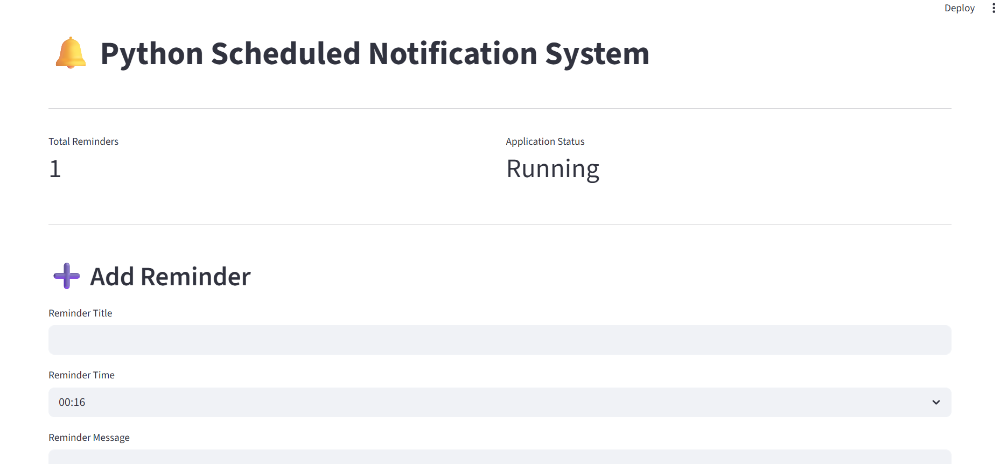
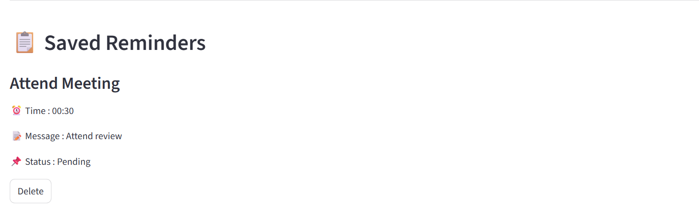
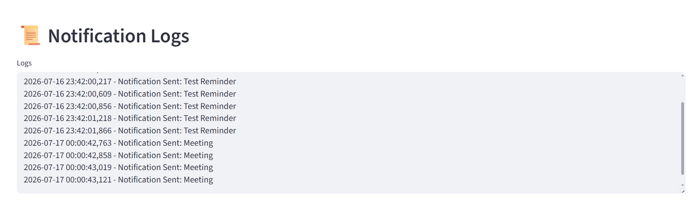

# 🔔 Python Scheduled Notification System


## 📌 Description

A Python and Streamlit-based application that allows users to schedule reminders and receive desktop notifications automatically at the specified time.


## ✨ Features

- Add reminders

- View reminders

- Delete reminders

- Desktop notifications

- Automatic scheduler

- Notification logs

- Reminder status (Pending/Completed)


## 🛠 Technologies Used

- Python

- Streamlit

- Plyer

- JSON

- Logging


## 📂 Project Structure


```

PROJECT-SCHEDULED-NOTIFICATION/

│── app.py

│── scheduler.py

│── reminder\_manager.py

│── notification.py

│── startup.py

│── requirements.txt

│── README.md

│── .gitignore

├── data/

├── logs/

└── screenshots/

```


\## ▶️ How to Run


Install dependencies:


```bash

pip install -r requirements.txt

```


Run the application:


```bash

streamlit run app.py

```


Run the scheduler:


```bash

python scheduler.py

```


## 📸 Screenshots











## 👨‍💻 Author


**Hasnikareddy Guduru**

